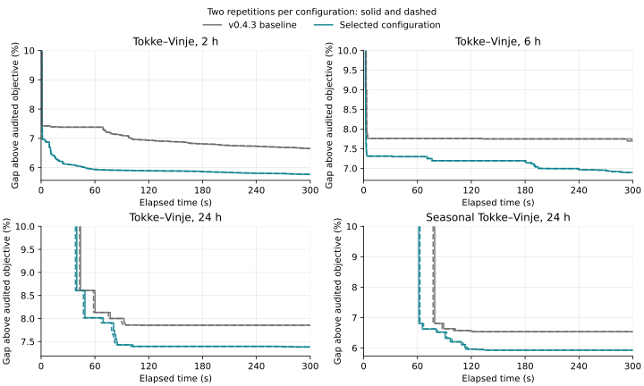

# Proof-speed experiments

Version 0.4.4 selects shared on-state coordinates, the wider certified root-cut
budget, and disabled extra bilinear projection LPs. Ordinary OBBT remains
enabled. In two paired five-minute repetitions, the selected setting improves
every operating final bound against 0.4.3, with unchanged delivered objectives.
The mean of the four operating gaps falls from 7.183% to 6.494%, a 9.6%
reduction. Larger cases still do not reach a global optimality certificate.

This comparison tests how quickly OpenSHOP improves a globally valid upper
bound. Subtracting the audited schedule value from that bound is inexpensive;
strengthening SCIP's relaxation is the expensive part. The experiments retain
the original nonlinear equations, table interpolation, operating restrictions
and commitment decisions.

## What changed

Three hypotheses were tested separately before combining them:

1. **Native tightening work.** Disable OBBT's additional two-dimensional
   bilinear projection LPs, enable its optional filtering rounds, or combine
   those settings. Ordinary OBBT and reusable generalized variable bounds remain
   enabled. Disabling the projection LPs does not disable the ordinary
   McCormick relaxation or nonlinear solver.
2. **Shared on-state coordinates.** Replace independent scalar gates on each
   power support with one consistent vector of running-state head weights and
   affine running-state discharge weights. The same certified coefficients
   are used in these comparisons. At binary commitment, the lifted formulation
   preserves the original on and off branches. At fractional commitment, it
   implies all the former scalar gate hulls and can be strictly stronger.
3. **Selected extra power supports.** At reliable root LP points, rank
   unit/interval coordinates by positive price, interval duration and optimistic
   power. Generate a bounded number of additional supports, certify them over
   the complete original running domain, and add only violated rows. Existing
   shared weights make the extra supports inexpensive to express.

The coefficient oracle includes the original PCHIP polynomial, extensions,
and a guarded bound on interpolation residuals between knots. Connecting raw
nodal power bounds without that residual correction would be unsafe. Relaxed
equation residuals guide selection; they are neither certificates nor a
decomposition of the objective gap. See [the model equations](model.md).

The production implementation uses concrete coordinate records, integer-indexed
native variables, cached certificates and reusable value and ranking buffers.
It retains one public solve path. Experimental policies remain in the archived
benchmark implementation.

The paired timings use that archived policy driver. Production retains the
selected coefficient oracle, ranking, cuts and limits with typed native buffers.
A separate public-API run checks this integration; it is not another matched
timing comparison.

## Screening and budget refinement

The first screen tested seven profiles on six cases for 120 seconds each. A
second screen tested five combinations. A third compared limited and wider
cut budgets, with and without bilinear projection work. All 102 runs supplied
accepted starts and schedules, usable global bounds, and error-free callbacks.
Every observed bound enclosed the best independently audited schedule in its
paired job.

The shared formulation reduced the ordinary 24-hour model from 27,452 variables
and 44,911 constraints to 26,141 variables and 36,544 constraints: 4.8% fewer
variables and 18.6% fewer constraints. No binary decisions were added. The head
lift alone added some variables; the combined saving came from removing the
independent discharge gates as well.

The limited separator permits 64 cuts, four rounds, 16 coordinates and cuts per
round, and 64 coordinate checks. The wider alternative permits 128 cuts, eight
rounds, 32 coordinates and cuts per round, and 256 coordinate checks. Both use
the same 1.5-second certificate allowance and five extra slope fractions:
0.125, 0.375, 0.625, 0.875 and 1.125 times the physical slope scale. The time
allowance is checked between coefficient vectors; a single vector may overrun
it and that overrun is reported.

The refinement produced these final gaps against each job's common audited
objective:

| Case | Baseline | Limited cuts, no projections | Wider cuts, no projections |
|---|---:|---:|---:|
| Tokke–Vinje, 2 h | 6.935% | 5.591% | 5.895% |
| Tokke–Vinje, 6 h | 7.762% | 7.375% | 7.193% |
| Tokke–Vinje, 24 h | 7.905% | 7.812% | 7.856% |
| Seasonal Tokke–Vinje, 24 h | 6.536% | 6.193% | 5.961% |

More cuts improved some bounds and slowed others. The two budgets therefore
advanced to confirmation. Optional OBBT filtering did not establish a consistent
additional benefit and was left at its native default. In the refinement,
certificate generation consumed 0.005–0.365 seconds for table cases. Extra LP
rows and the subsequent search, rather than polynomial computation alone,
determine whether a wider budget pays off.

## Repeated five-minute confirmation

Each pair below used the same audited objective. Gaps and times are medians
of two repetitions; all delivered operating objectives were identical within
their paired job.

| Case | Audited objective | Baseline gap | Selected gap | Common target | Time to target: baseline / selected |
|---|---:|---:|---:|---:|---:|
| Tokke–Vinje, 2 h | 72,197.273 | 6.653% | 5.769% | 7% | 99.79 / 1.46 s |
| Tokke–Vinje, 6 h | 217,669.103 | 7.691% | 6.893% | 8% | 3.43 / 2.49 s |
| Tokke–Vinje, 24 h | 738,921.786 | 7.855% | 7.383% | 8% | 91.06 / 68.23 s |
| Seasonal Tokke–Vinje, 24 h | 453,194.141 | 6.533% | 5.929% | 7% | 78.35 / 62.18 s |

The selected 6-hour runs additionally reach 7% in 194.39 seconds, and the
seasonal runs reach 6% in 114.90 seconds. Neither baseline reaches those
targets within five minutes. No operating profile reaches 5%, 1%, or 0.01%
in this confirmation. Faster time to a partial gap is not faster time to a
completed global proof.

The smaller budget gives a better 2-hour final gap, 5.511%, and reaches 6% in
15.60 seconds rather than the selected 49.47 seconds. The wider budget gives
better final bounds on the other three cases: 6.893% versus 7.062% at 6 hours,
7.383% versus 7.654% at 24 hours, and 5.929% versus 6.193% seasonally. It also
has lower time-averaged gaps on those larger cases after all profiles first
reach 10%. This tradeoff favors the larger horizons for the single production
configuration; the smaller budget is retained only in the experiment archive.



Every line is one repetition. Time includes construction and optimizer transfer.
The vertical axes show gaps at or below 10%, relative to the common audited
objective in each panel. Different panels use different vertical ranges.

Both small guard cases obtain actual certificates:

| Case | Baseline / selected objective | Median proof-stage time | Median return time including audits |
|---|---:|---:|---:|
| Turbine-table case | 9,851.227255 / 9,851.227307 | 0.676 / 0.280 s | 0.707 / 0.444 s |
| Analytic distributed-river case | 14,860.129617 / 14,860.129617 | 0.589 / 0.509 s | 0.622 / 0.544 s |

The selected table case has return times 0.573 and 0.314 seconds; its proof-stage
times are tightly grouped near 0.28 seconds. The 0.623% table gap against the
frozen initial schedule is not a failed certificate: the solver discovers a
better audited incumbent. Its own final gap is below the requested 0.01%.

Ordinary OBBT remains substantial. Its median native timer is 170.75 seconds
at 6 hours, 169.98 seconds at 24 hours and 164.75 seconds seasonally. The 2-hour
OBBT timer falls from 66.31 to 6.62 seconds. Native plugin timers can overlap
other timers and are not additive. The remaining cost is in native relaxation
and global search, rather than computing the gap percentage or generating
polynomial coefficients.

## Measurement protocol

The baseline is version 0.4.3, commit
`7743702366ad96ce2ecfa24881c66a44a887c9a5`. Each matrix job freezes one case and
one audited initial schedule. All profiles in that job use the same inputs,
controls, dependencies and one solver thread. Preparation and compilation
warmups are measured separately. Construction, optimizer transfer, callbacks
and optimization consume the global allowance. Extraction and physical audits
can overrun it; total elapsed time retains that overrun.

Confirmation compares the baseline with both cut budgets for 300 seconds, twice
each, reversing profile order in the second repetition. Time-to-gap observations
come from SCIP's global `DUALBOUNDIMPROVED` events in original objective units,
including model construction. A final accepted bound supplies a conservative
attainment time if no event reports it. Local LP, probing and diving values are
never proof bounds. The observation callback's measured overhead is retained.
Unreached thresholds are right censored, not replaced by the time limit.

Primary time comparisons use the same frozen audited lower bound. The best
accepted objective across a job is also used to check every bound. Timing
against that pooled objective is retrospective and assumes that schedule was
already known; it does not measure discovery of the incumbent. Small solved
cases report actual certificate time and their own audited objectives. Different
jobs can obtain different preparation schedules, so raw gaps and times are
compared within jobs, not spliced across campaigns.

The unchanged Manifest SHA256 is
`d0079266b836f68bbf9d5fc159d4f571d3bf3b6ef104dc2c8c3448bacfbbfa97`.
The hosted runs use Julia 1.13.1, JuMP 1.32.0, SCIP.jl 0.12.8, SCIP 10.0.3
and SoPlex 8.0.3. Records identify CPU, thread counts, case/control/source hashes,
global-bound trajectories and native LP/OBBT/separator statistics.

## Correctness and scope

The full production test suite has 14,743 assertions. Focused checks cover
binary equivalence, implication of every former signed gate facet, strict
fractional witnesses, constant/fixed coordinates, negative off-state head and
efficiency, complete starts, operational limits, PCHIP and extrapolation.
Native tests verify that a new globally certified row enters the current LP
and strengthens its bound. A deliberately faulty oracle exercises callback
failure containment and rejection of the resulting bound while preserving the
audited schedule.

The selected production source also passed Linux and macOS CI and a separate
[public-API validation](https://github.com/monochromatti/open-shop/actions/runs/37738307125):
six cases, free and conditional fixed commitments, with 120 seconds per solve.
All 12 starts and returned schedules passed their audits, all bounds enclosed
the independently checked reference schedule, and no cut callback or native
row-infeasibility errors occurred. The recorded work limits match the selected
128-cut, eight-round, 256-coordinate budget. These runs validate integration;
their different prepared schedules and allowance prevent a paired speed claim.

These are numerical bounds for the declared bounded discrete model under solver
tolerances. They do not establish continuous-time global optimality or full
SHOP coverage. The Tokke–Vinje cases retain the documented reconstruction scope
and operating-rule exclusions. Finer chronological replay checks feasibility;
it does not extend the scope of the optimization certificate.

## Sources and reproduction

The shared lift is derived for this model, informed by indicator-aware weight
formulations: [Sridhar, Linderoth and Luedtke](https://jrluedtke.github.io/papers/sridharetal-orl13.pdf).
The native effort ablation follows the distinction between ordinary OBBT and
[two-dimensional bilinear projections](https://optimization-online.org/wp-content/uploads/2019/03/7122.pdf)
in the [pinned SCIP source](https://github.com/scipopt/scip/blob/v10.0.3/src/scip/prop_obbt.c).
Treating the complete power polynomial jointly is informed by
[He and Tawarmalani](https://arxiv.org/html/2310.07168v2).
None of their reported speedups is treated as an OpenSHOP measurement.

Campaigns: [first screen](https://github.com/monochromatti/open-shop/actions/runs/37729035609),
[combinations](https://github.com/monochromatti/open-shop/actions/runs/37730112283),
[budget refinement](https://github.com/monochromatti/open-shop/actions/runs/37732208118),
and [confirmation](https://github.com/monochromatti/open-shop/actions/runs/37733769105).

The [scalar evidence and native statistics](../benchmark/results/proof-speed.json)
retain all 138 comparison runs. Runnable policies, tests, protocol, collector,
comparison and plotting scripts are archived at
[`proof-speed-experiments-2026-10-08`](https://github.com/monochromatti/open-shop/tree/proof-speed-experiments-2026-10-08).
The archive pins Julia 1.13.1; plotting uses Matplotlib 3.9.4.

To rerun the comparison on a synthetic case in the archive:

```sh
./scripts/julia.sh benchmark/proof_speed_profile.jl \
  benchmark/cases/turbine-tables.json results/proof-speed \
  300 2 baseline,shared_cuts_no_bilin,shared_cuts_wide_no_bilin true
```

For operating cases, fetch and import the pinned dataset using the documented
[Tokke–Vinje workflow](../examples/tokke_vinje/README.md). Its inputs are not
bundled into the benchmark evidence. The production Performance workflow runs
only the selected public solver and records both free and conditional fixed
commitments.
