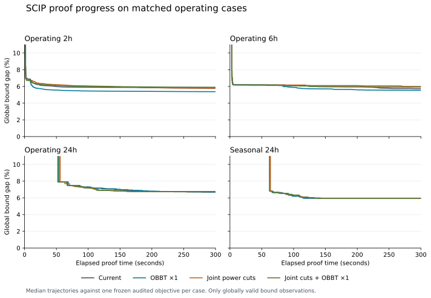

# Root proof experiments

Version 0.4.5 reduces SCIP's ordinary OBBT iteration multiplier from 10 to 1.
It retains the existing formulation and power separator. Joint envelope cuts
were valid but worsened the five-minute operating results, so they remain in
the experiment archive. No solver-policy selector is added to the public API.

The selected change reaches the control's common final upper bound about
14.2 times sooner on the 2-hour case and 2.3 times sooner on the 6-hour case.
The 24-hour cases show little improvement. This is faster progress toward a
valid bound, not a demonstrated speedup to complete global optimality.

## Confirmation and selection

Four profiles were compared at 300 seconds, twice per case, reversing order
in the second repetition. These are median gaps using the last globally valid
bound observed within the nominal allowance and the same frozen audited
objective within each case:

| Case | Current 0.4.4 | OBBT ×1, selected | Joint cuts | Joint cuts + OBBT ×1 |
|---|---:|---:|---:|---:|
| Operating 2 h | 5.768% | 5.373% | 5.788% | 5.899% |
| Operating 6 h | 5.722% | 5.534% | 5.996% | 5.921% |
| Operating 24 h | 6.690% | 6.695% | 6.753% | 6.753% |
| Seasonal 24 h | 5.929% | 5.929% | 5.947% | 5.947% |

The delivered objective is identical across profiles within every operating
case. The two small guards certify their delivered schedules in all 16
confirmation runs. Preparation can find different schedules between campaigns;
screening and confirmation gaps therefore must not be compared as a progression.

| Case | Current time to common bound | Selected time | Attainment, current / selected |
|---|---:|---:|---:|
| Operating 2 h | 299.51 s | 21.10 s | 2/2 / 2/2 |
| Operating 6 h | 292.61 s | 126.03 s | 2/2 / 2/2 |
| Operating 24 h | 278.11 s | Censored | 2/2 / 1/2 |
| Seasonal 24 h | 137.79 s | 136.32 s | 2/2 / 2/2 |

The common target is the larger of the two final control upper bounds, so both
control repetitions attain it. A median time is reported only when both
repetitions reach that target within 300 seconds.

In the ordinary 24-hour case, the selected gaps are 6.69985% and 6.68961%,
compared with 6.68961% in both controls. This small regression is disclosed;
the seasonal difference is negligible. The weaker ordinary repetition stops
before its first OBBT call, on the same preceding upper-bound sequence as the
controls; it does not demonstrate weaker tightening from the smaller multiplier.
The choice is justified by repeatable
shorter-horizon gains, nearly unchanged longer-horizon bounds, and one native
parameter change. It is not a universally optimal SCIP setting.

The 6-hour control spends a median 191.55 seconds in OBBT and first branches
at 203.31 seconds. The selected configuration spends 69.15 seconds in OBBT and
first branches at 81.58 seconds. Both 24-hour cases still process only the root
within the allowance. Their observed root-branch events occur just after the
time limit and do not demonstrate a useful tree search within five minutes.

Operating actual return times are about 300.3–303.4 seconds, including physical
reconstruction and replay. No operating case reaches a global certificate.
The remaining obstacle is still the optimistic root relaxation and the cost of
strengthening it on the longer horizons.



## Screening

Thirty matched runs compare the current 0.4.4 configuration, two smaller OBBT
iteration allowances, a cumulative OBBT boundary budget, and joint power cuts.
Each case uses one frozen input and one audited initial schedule, with a
120-second allowance per solve.

| Case | Current | OBBT ×1 | OBBT ×0.25 | Boundary budget | Joint cuts |
|---|---:|---:|---:|---:|---:|
| Operating 2 h | 5.895% | 5.443% | 5.560% | 5.444% | 6.026% |
| Operating 6 h | 7.193% | 7.008% | 7.048% | 7.006% | 7.086% |
| Operating 24 h | 7.063% | 7.063% | 7.063% | 7.063% | 7.060% |
| Seasonal 24 h | 6.203% | 6.109% | 6.109% | 6.109% | 6.080% |

These are final upper-bound gaps against the same frozen audited objective
within each case. Both small guards certify their delivered schedules in every
profile. Their frozen-seed gaps are not their certificate gaps: the table case
finds a better schedule than its seed.

The 6-hour case exposes stalled root work. The current configuration spends
112.87 seconds in OBBT and processes one node. Multiplier 1 spends 6.60 seconds
in OBBT, begins branching at 11.54 seconds, and processes 685 nodes. Its final
gap is smaller. Multiplier 0.25 starts branching sooner but finishes slightly
worse than multiplier 1 on both shorter operating cases.

Joint cuts reach the current 6-hour run's final upper bound in 3.23 seconds,
compared with 109.21 seconds for the control. This occurs before any completed
OBBT call. Their eventual tightening cost remains 111.30 seconds. They worsen
the 2-hour final gap, so early bound improvement alone does not establish an
overall performance gain.

Generating and certifying joint cuts takes 0.255–0.687 seconds on the operating
cases, including 0.023–0.040 seconds of residual certification. None reaches
the 1.5-second work limit. The significant cost is how the added rows affect
SCIP's subsequent LPs, tightening and tree search. Further optimizing the
Julia certificate code would save little of the observed solve time.

Neither 24-hour run reaches OBBT within two minutes: ordinary dual LP work
accounts for approximately 91–97 seconds. Therefore their factor-only
screening differences do not demonstrate an OBBT benefit. Native time limits
can stop runs at slightly different completed LPs. The cumulative boundary
budget never activates in the screen.

The current 6-hour run's late observed tightening interval takes another
57.53 OBBT seconds and reduces its global upper bound by only 0.000029 objective
units. This is observed marginal bound progress; it does not establish that
all reductions or generalized bounds have no later value.

## Formulation and measurement

Ordinary OBBT uses a per-call iteration allowance equal to the larger of
5,000 and a multiplier times root LP iterations. The native multiplier is 10.
The experiments use 1 and 0.25. Repeated calls can renew this allowance; zero
would mean unlimited. The boundary budget stops subsequent calls only after
an ordinary root LP boundary observes at least 30 cumulative OBBT seconds.
It cannot interrupt an invocation, and records actual work and any overrun.

Joint power cuts use the existing on-state discharge weights ν and head
weights ζ:

```math
P \leq \sum_j a_j\nu_j + \sum_k b_k\zeta_k.
```

A small HiGHS LP minimizes this envelope at the current root point. Bernstein
coefficient inequalities cover every original polynomial cell and linear
extension. An independent residual check supplies a conservative correction.
The electrical-efficiency upper bound also covers negative hydraulic
extensions by enclosing the larger of zero and power at maximum electrical
efficiency. Signed coefficients are permitted; both weight sums equal
commitment, so the row vanishes correctly when a unit is off. No fitted curve,
new partition, or new binary decision is introduced.

Only SCIP's global-bound events and final accepted solver bound supply proof
trajectories. Local root LP objectives are diagnostic observations, converted
from SCIP's transformed objective. They never certify a gap. The diagnostics
also record first branching, completed OBBT calls, cumulative plugin time,
and ordinary LP work. OBBT time can overlap probing/diving LP time; SCIP's
ordinary dual-LP timer excludes those probing solves.

The full Linux and macOS suites pass. The experimental tests include 28 root
measurement/budget checks and 2,356 joint-cut assertions, including native cut
application, original curves and extensions, signed/off-state coordinates,
complete free/fixed starts, and failure handling. All 30 screening runs retain
audited schedules, complete starts, valid enclosing global bounds, and
error-free callbacks. All 48 confirmation runs meet the same checks. The
selected production change also passes 14,743 library assertions and a separate
public-API 2-hour check with free and fixed commitments. That check validates
integration; its hardware, schedule and 60-second allowance do not support an
additional matched performance claim.

Eighteen analysis tests exercise grouping, provenance, invalid observations,
right censoring, improved incumbents and native time-limit overruns. Ordinary
and seasonal 24-hour imports have the same internal name; the report identifies
them by artifact label and input hash.

## Reproduction

The experimental implementation, tests, protocol and analysis are archived at
[`root-proof-experiments-2026-10-08`](https://github.com/monochromatti/open-shop/tree/root-proof-experiments-2026-10-08).
The screening revision is `93c0dc4638087109c3fc43a2ac0214da42fdf681` and its
[workflow](https://github.com/monochromatti/open-shop/actions/runs/37802973830)
provides native statistics and scalar measurements. The
[confirmation workflow](https://github.com/monochromatti/open-shop/actions/runs/37806304906)
uses revision `fc60e677404d6f197a8251ca1475c6d344a1b763`, with the same solver
and benchmark implementation. The
[retained evidence](../benchmark/results/root-proof.json) includes all 78
records, trajectories, comparisons and relevant native timing, LP, root,
propagator and separator statistics. Other native plugin listings remain in
the workflow artifacts. Imported inputs and controls are not bundled.

Julia 1.13.1 and the checked-in Manifest fix the toolchain. Runs use one Julia,
BLAS and native SCIP thread.
Construction, copy, callbacks and native optimization count toward the solve
allowance. Preparation and explicit warmup are excluded. Actual return time
includes independent reconstruction and chronological replay.

The native budget semantics follow the pinned
[SCIP OBBT implementation](https://github.com/scipopt/scip/blob/v10.0.3/src/scip/prop_obbt.c).
These results concern the declared bounded discrete model under numerical
solver tolerances. The Tokke–Vinje reconstruction retains its documented
operating-rule exclusions; it is not full SHOP compatibility or a
continuous-time optimality proof.

To reproduce a synthetic comparison in the experiment archive:

```sh
./scripts/julia.sh benchmark/root_proof_profile.jl \
  benchmark/cases/turbine-tables.json results/root-proof \
  300 2 current,obbt_1,joint,joint_obbt_1 true
python3 benchmark/root_proof_summary.py results/root-proof \
  --output results/root-proof-comparison.json
```
